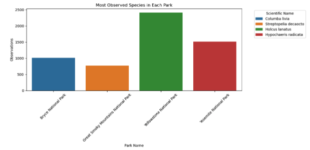
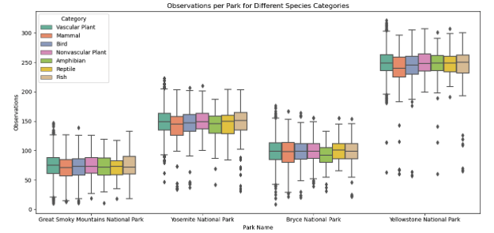
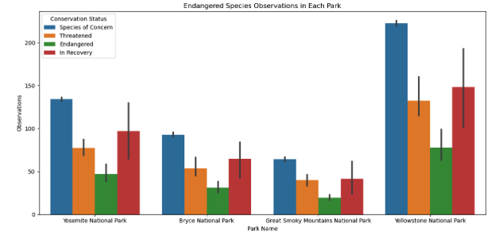
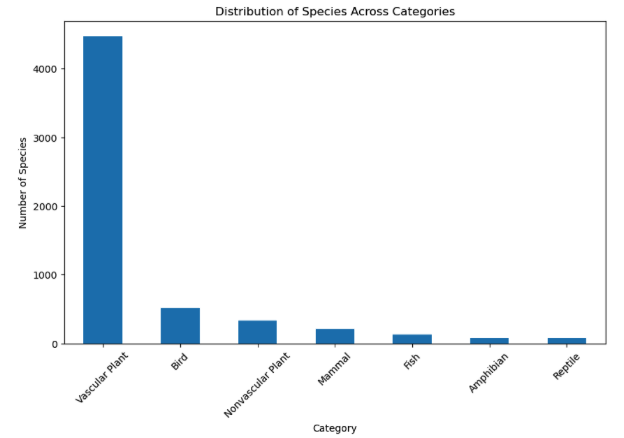
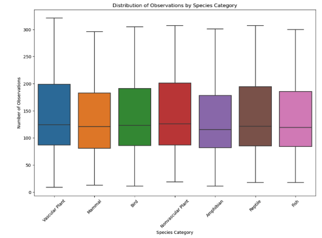

Biodiversity in National Parks: Species Observations and Conservation Analysis

A. Introduction

This project investigates biodiversity data, focusing on species observations and their conservation statuses in national parks. Leveraging Python and its libraries like Pandas, Matplotlib, Seaborn, and SciPy, the analysis aims to derive insights into species distribution, observation frequency, and conservation needs across various parks.

B. Data Description

The dataset encompasses two key files:

observations.csv: Contains records of species observations in national parks, featuring the park name, species observed, and the count of observations.
species_info.csv: Provides details on each species, including its scientific name, category (e.g., Mammal, Bird), and conservation status.
Key Data Attributes:

Park Name: Identifier of the national park.
Scientific Name: The scientific designation of each species.
Common Names: Commonly used names for the species.
Observations: Count of individual species observations in the parks.
Conservation Status: Status indicating the level of endangerment (e.g., Endangered, No Concern).
The dataset presents a comprehensive view of various species, capturing a wide range of conservation statuses and observational data across different national parks.

C. Methodology

Data Cleaning
Checked for duplicates and missing values to ensure the integrity and quality of the data.
Filled missing values in 'conservation_status' with 'No Concern' for standardization.
Analytical Approach
Merged datasets for a holistic analysis.
Grouped data by relevant attributes (conservation status, park name, species category) for detailed examination.
Statistical Testing
Chi-Squared Test: Assessed the distribution uniformity of endangered species across parks.
ANOVA: Evaluated differences in observations among species categories.
Visualization
Utilized a variety of plots (bar, box, pie charts) to visualize the data, aiding in understanding species distribution, conservation status, and observation frequency.

Certainly! Below is the drafted README section D. Analysis, focusing on "Analysis by Park" based on the provided code snippets.

D. Analysis

###Analysis by Park###

The biodiversity within national parks is vast and varied. To delve into this richness, our analysis first focuses on observation counts across different parks, identifying which parks have higher instances of species observations, and thereby suggesting areas of high biodiversity and visitor interest.

1. Observation Counts by Park: 

We aggregated the total number of species observations for each park to determine which parks are most frequented by different species. The horizontal bar chart created from this data visually emphasizes the disparities between the parks, highlighting which parks may offer more robust habitats for wildlife or perhaps better opportunities for observation by visitors.

2. Most Observed Species in Each Park: 

By grouping the data by park and species, and summing the observations, we pinpointed the most observed species in each park. A bar chart was then used to illustrate these species, offering insights into which species might be emblematic or particularly abundant in each park. This analysis not only draws attention to these species but may also raise questions about their habitat conditions and the factors contributing to their high observation rates.

3. Observations Per Park For Different Species Categories: 

A boxplot visualization was employed to display how observations are distributed among different species categories across the parks. This comparison provided a multi-faceted view of the parks' biodiversity, shedding light on the presence and visibility of various species categories such as mammals, birds, reptiles, etc., within each park.

4. Endangered Species Observations in Each Park: 

Focusing on conservation, we analyzed the observations of endangered species, differentiating them by conservation status. The resulting bar chart serves as a stark visual reminder of the conservation challenges and efforts within these parks, indicating which parks report more frequent observations of species that are of concern, threatened, or endangered.

5. Statistical Analysis - 

Chi-Squared Test: To understand the distribution of endangered species across parks and whether certain parks are more favorable to the survival of these species, we performed a Chi-Squared test. 

This statistical test measured the deviation of observed frequencies of endangered species from what would be expected if the species were distributed uniformly across the parks. 

The test results, including the Chi-Squared statistic and the p-value, provided a quantitative measure of these distributions, potentially reflecting different levels of conservation efforts across the parks.

###Analysis By Category###

The diversity of species within national parks is a testament to the natural richness of these ecosystems. This segment of our study examines the variety of species across different biological categories and assesses the frequency of their observations.

1. Distribution Of Species Across Categories:

To visualize the variety of life forms present in the dataset, we charted the number of species across each category such as mammals, birds, amphibians, etc. The bar chart revealed a striking dominance of vascular plants, suggesting their ubiquity in park ecosystems. In contrast, other categories showcased significantly fewer species, highlighting the comparative rarity of certain groups within these natural environments.

2. Distribution of Observations by Species Category:

Further, we explored how often species within each category are observed, which can indicate their abundance or the likelihood of detection. A boxplot revealed the median and variability in observation frequency across categories, with some showing a wider spread, possibly hinting at a greater ease of observability or sheer number in the parks.

3. Statistical Analysis -

ANOVA Test: Our analysis utilized an ANOVA test to determine if the differences in the number of observations across various species categories (like mammals, birds, etc.) were significant. This test compares the means of observations in each category to see if they differ more than would be expected by chance.

The results of the ANOVA test, indicated by the F-Statistic and the p-value, showed a significant difference in the number of observations across categories. Specifically, the p-value was much lower than 0.05, which strongly suggests that these differences are not random.

In simpler terms, this means that some categories of species are observed more frequently than others in national parks. This finding is crucial for conservation efforts, as it points to the need for category-specific strategies to preserve the diverse range of species in these environments.

###Analysis By Conservation Status###

###Analysis By Species###
